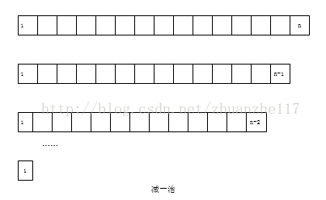
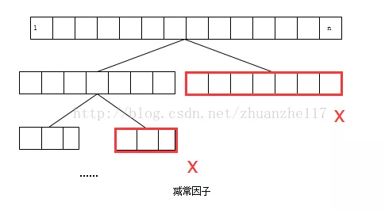
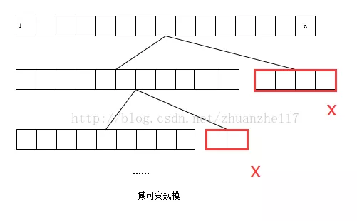

---
authors:
    name: BUAAer-xing
    title: 北航HPC硕士生
    url: https://github.com/BUAAer-xing
    image_url: https://cdn.jsdelivr.net/gh/NEUQer-xing/Markdown_images@master/images-2/icon.png
---

# 北航-算法与程序设计原理期末真题复习

## 算法考题形式

- **一、判断题**
	- 判断正确和错误
	- 比如：分支定界算法一般用DFS（✅）
- **二、简答题**
	- 比如：问一个问题是否为NP完备问题，为何？如何证明？
- **三、四、五：三个大题**
	- 随机题（考什么的可能性都有，考分治算法的可能性最大）
	- 动态规划题
	- 分支定界题

## 一、判断题

（只要是遇到不确定的就直接选择错误！！！）

- 1、 贪心算法所做的每一步选择所产生的部分解，不一定是可行性的。（❌）
	- 贪心算法的核心是所做的每一步都必须满足三个条件：
		- **可行性**：每一步必须都是**可行的**，它必须满足问题的约束
		- **局部最优性**：这一步是当前步骤中所有可行性选择中最佳的局部选择
		- **不可取消**: 该步骤一旦做出，在算法的后续步骤就无法改变了
- 2、一个正确的算法，对于每一个合法输入，都会在有限的时间内输出一个满足要求的结果。（❌）
	- 对于无限大的输入，即使是正确的算法，也无法在有限的时间内进行输出。
	- 算法的正确性可以有以下三层含义：
		- 程序不含语法错误
		- 程序对于几组输入数据能够得出满足规格说明要求的结果
		- 程序对于**精细选择的典型、苛刻而带有刁难性的几组输入数据**能够得出满足规格说明要求的结果
- 3、在动态规划中，各个阶段所确定的策略就构成一个策略序列，通常称为一个决策。（❌）
	- 某阶段状态给定以后，从该状态演变到下一个阶段某状态的**选择**称之为决策；
	- 由每个阶段的**决策组成的决策函数序列**就称为全过程策略，简称**策略**。（也可以称为问题的解）
- 4、通常来说，算法的最坏情况的时间复杂性比平均情况的时间复杂性容易计算。（✅）
	- 在很多情况下，各种输入数据集出现的概率难以确定，算法的平均时间复杂度也就难以确定。
	- 因此，另一种更可行也更常用的办法是讨论算法在最坏情况下的事件复杂度，即**分析最坏情况以估算算法执行时间的一个上界**。
- 5、回溯法用深度优先法搜索状态空间树（✅）
	- **回溯法**：通常以**递归**的方式实现。
	- 在算法执行过程中，它会通过不断地尝试各种选择并递归地搜索可能的解决方案。
	- 每次递归调用都代表着对问题空间的进一步探索，直到找到满足条件的解或者确定该路径无解为止。
	- 回溯算法的关键是**不断地进行选择、探索和回溯，以探索状态空间树中的所有可能路径，直到找到问题的解或者确定无解为止**。这种方法通常适用于解决各种组合、排列、搜索等类型的问题，通过**深度优先搜索的方式**来穷尽搜索空间。
- 6、快速排序算法的平均时间复杂度是O(nlogn)，使用随机化快速排序算法可以将平均时间复杂度降的更低。（❌）
	- 随机化快速排序算法通过在每次选择基准元素时随机选择，可以减少最坏情况发生的概率，从而提高算法的性能。通过随机选择基准元素，**平均情况下最大化了分割数组的可能性**，从而**平均时间复杂度更接近于 O(nlogn)**。
	- 只能减少快排时出现最坏情况的概率，并无法将时间复杂度降低至O(nlogn)以下。
- 7、P类和NP类问题的关系可以用$P \in NP$来表示。（✅）
	- P中所有的问题均属于NP问题
	- 
- 8、NP完全问题比其他所有NP问题都要难（❌）
	- 即使NPC问题发现了多项式级的算法，NP-Hard问题有可能仍然无法得到多项式级的算法
	- 一个问题是NP完全意味着它不仅属于NP问题集合，而且其他内部所有的NP问题都可以在多项式时间内归约到这个问题。这意味着如果我们能够在多项式时间内解决一个NP完全问题，那么我们也可以在多项式时间内解决所有的NP问题。
	- 在计算复杂性理论中，**有许多NP问题，它们可能不是NP完全问题**，但同样可能是相当困难的，因为尚未找到多项式时间内解决它们的有效算法。因此，并不是所有NP问题都比NP完全问题容易解决，但NP完全问题是最具挑战性的一类NP问题之一。
- 9、若P2多项式时间转化为（polynomially transforms to）P1，则P2至少与P1一样难（❌）
	- P2->P1 说明难度对比为： $P_1 \ge P_2$
	- 因此，P1至少与P2一样难
- 10、一个完全多项式近似方案是一个近似方案$\{A, \}$，其中每一个算法A，在输入实例$I$的规模的多项式时间内运行。（❌）
	- 
	- 多项式近似方案（Polynomial-Time Approximation Scheme, **PTAS**）
		- 多项式近似方案是指对于给定的最优化问题，在多项式时间内找到一个解，该解的目标函数值与最优解的比值可以在一定限度内无限接近1。
	- 完全多项式近似方案（Fully Polynomial-Time Approximation Scheme, **FPTAS**）
		- 完全多项式近似方案是多项式近似方案的一个特殊类型，它要求算法在多项式时间内生成一个近似解，并且有一个参数 $\epsilon$（epsilon），该参数确定了近似解和最优解之间的最大相对误差。
- 11、基于比较的寻找数组A[1,...,n]中最大值元素问题的下界是$Ω(n/3)$。（❌）
	- 基于比较，最快的情况是$Ω(n-1)$
	- 
- 12、Las Vegas算法只要给出解就是正确的（✅）
	- Las Vegas 算法是一种随机化算法，其名称源自拉斯维加斯（Las Vegas）赌场，因为这种算法的特点类似于在赌场中的随机性。
	- Las Vegas 算法是指在执行过程中可以**使用随机性来产生不同的结果**，但<font color='red'><b>保证其结果的正确性，并且具有确定性的运行时间</b></font>。
- 13、若近似算法A求解某极小化问题一实例的解为Sa，且已告知该问题的最优解为Sa/3，则该近似算法的性能比为3（❌）
	- 仅仅针对一实例无法确切表达
	- 性能比是<font color='red'><b>所有实例可能的精确率的上界</b></font>。
	- **性能比是一个来指出近似算法质量的主要指标，我们需要那些RA尽量接近1的近似算法。**
- 14、$O(f(n))+O(g(n))=O(\min\{f(n),g(n)\})$ （❌）
	- $O(f(n))+O(g(n))=O(\max\{f(n),g(n)\})$
- 15、$\text{若}f(n){=}\Omega(g(n)),\quad g(n){=}\Omega\left(h(n)\right),\text{则}\quad f(n){=}\Omega(h(n))$ （✅）
- 16、$\text{若}f(n)=O(g(n)), \text{则} g(n)=\Omega(f(n))$ （✅）
- 17、贪心算法通过增加空间复杂性来减少时间复杂性（❌）
	- 一般情况下，贪心算法通常**具有较低的时间复杂度和空间复杂度**，因为它通常只需要存储当前状态和一些局部信息，不需要额外的数据结构或复杂的存储。
- 18、直观地讲，P 类问题是易解的问题；而 NP 问题是易被验证的问题（✅）
	- P问题是指可以在多项式时间内进行求解的问题
	- NP问题是指一个结果可以在多项式时间内被验证的问题
- 19、下列问题是一个判定问题：给定一个合取范式，对其中的所有逻辑变量求一组真值赋值，使得给定的合取范式在该组真值赋值下为真。（）
	- 判定问题：判定问题（Decision Problem）是计算理论中的一个概念，是<font color='red'><b>指那些问题的解可以用“是”或“否”来回答的问题</b></font>。换句话说，判定问题要求对于给定的输入实例，算法必须给出一个布尔值作为回答，而不需要给出具体的解。

## 二、问答题

---
### 1、二叉查找树属于减治策略的三个变种中哪一个的应用？什么情况下二叉查找树表现出最差的效率？此时的查找和插入算法的复杂性如何？
- （1）二叉查找树属于**减可变规模变种**的应用
- （2）当**节点个数等于二叉查找树的高度**时表现出最差的效率
- （3）此时查找和插入算法的时间效率都为$O(n)$


**知识回顾**：

<font color='red' size='6'><b>减治法</b></font>采取**划分后选择计算** 的思想，利用一个问题和同样较小规模的问题之间的某种关系进行划分。

我们先确立这种关系，然后既可以从顶至下，也可以从底至上地来运用该关系，将**大问题分解成小问题来解决**，像是层层[嵌套](https://so.csdn.net/so/search?q=%E5%B5%8C%E5%A5%97&spm=1001.2101.3001.7020)。<font color='red'><b>在实际解决的过程中只针对部分子问题进行求解。</b></font>

常用的三种主要变种：
- **减一个常量**（常常是减1，比如插入排序）
	- 
- **减一个常数因子**（常常是减去因子2，例如：折半查找）
	- <font color='red'><b>减去常数因子实际上就是把规模除以一个常数</b></font>。（在多数情况下，这个常数因子是 2）
	- 
- **减去的规模是可变的**（比如：欧几里得算法）
	- 就是指每次减去的规模的**模式或数值是**不同的
	- 
	- 举例：
		- 欧几里得算法是一种求**最大公约数**的较为简便的方法，也叫**辗转相除法**。
		- 二叉查找树：不是AVL树，则每次减去的分支规模可能会是不同的。

<font color='red' size='6'><b>分治法</b></font> 这种策略将一个复杂问题分解成更小的子问题，然后解决这些子问题，最后将子问题的解合并为原始问题的解。

从字面上分析就可以看到有哪些步骤：  
**分-分解-** 将问题分解为规模更小的子问题，子问题最好相同或相似；  
**治-求解-** 将这些规模更小的子问题逐个击破；  
**合-合并-** 将已解决的子问题合并，最终得出原问题的解；

区分：**分治法**对分治出的部分需要分别处理，进行分开的单独计算，而**减治法**则利用了"一个问题给定实例的解和同样问题较小实例的解之间的关系"，只针对部分子问题求解，减治掉的那部分就不需要了。

举例：快速排序、大整数乘法、Strassen矩阵算法、棋盘覆盖问题、线性时间选择问题

<font color='red' size='6'><b>变治法</b></font>就是基于**变换**的一种思想方法，首先把问题的实例变得容易求解，然后进行求解。这个方法的思路类似于数学建模的思路，将生活中的问题进行简单的抽象、归化，以便对此进行研究。<font color='skyblue'>它不是一种标准的算法，更多的是一种思考的方式。</font>

变治法的工作可以分成两个阶段：首先**把问题变得更容易求解**，然后**对实例进行求解**。

根据我们对问题实例的变换方式，变治思想有3种主要的类型：
- 1.**实例化简**(Instance simplification)。  （条件变简单）
	- 指将原问题变换为同样问题的一个更简单或者更方便的实例。---- 预排序
- 2.**改变表现**(Representation Change).   （求解变简单）
	- 指将原问题变换为同样实例的不同表现。我们介绍一个很经典的栗子：**霍纳法则**。
- 3.**问题化简**(Problem reduction). （找已经知道的算法）
	- 指将原问题变换为另一个问题的实例，这种问题的算法是已知的。
	- （归化思想）转换的难题在于如何找到一个变换的目标算法。
	- **线性规划**就是一个很好的目标。举例：**背包问题=>线性规划问题**。


---
### 2. 何谓伪多项式算法？如何将一Monte Carlo算法转化为Las Vegas算法？
- （1）伪多项式算法是一种在L值的多项式时间内运行的算法，其中L是输入实例的最大数值（Value）。
- （2）Las Vegas算法一定会得到正确的解。<font color='red'><b>一旦用Las Vegas算法找到一个解，这个解就一定是正确解，如果没有正确解，就不会输出</b></font>。而<font color='red'><b>Monte Carlo算法每次都能得到问题的解，但是不能保证解的准确性</b></font>。
	- 转化：可以在Monte Carlo算法给出的解加上一个**验证算法**，如果正确就得到解，如果错误就不能生成问题的解，这样Monte Carlo算法便转化为了Las Vegas算法

**知识回顾**：

<font color='red' size='6'><b>伪多项式算法</b></font>：最差情况时间复杂度取决于**输入数值**(Value)（而不是输入的个数n）的算法称为伪多项式算法。 一些NP完全问题具有伪多项式时间解。例如，**0-1背包**解决方案是伪多项式。 

另一方面，其时间复杂度仅基于数组（不是值）中的元素数的算法被认为是多项式时间算法。

<font color='red' size='6'><b>Monte Carlo 算法和 Las Vegas 算法</b></font>都是随机化算法，它们在算法设计中使用了随机性，但在性质和行为上有所不同。
1. **Monte Carlo 算法：**
   - 特点是可以在有限时间内给出答案，但这个答案不一定是正确的，它可能是不确定的或有一定概率的错误。
2. **Las Vegas 算法：**
   - Las Vegas 算法保证在有限时间内给出一个正确的结果。
   - Las Vegas 算法的运行时间是确定的，但它**可能利用随机性来提高效率**。虽然在算法执行过程中可能使用随机性，但它保证所得结果是正确的。
   - 与 Monte Carlo 算法不同，Las Vegas 算法在产生结果时不会出现错误的可能性，**它的随机性仅影响算法的效率，而不影响结果的准确性**。

---

### 3. 构造AVL树和2-3树的主要目的是什么？他们各自有什么样的查找和插入效率？
- （1）当先后插入的关键字有序时，构成的二叉查找树蜕变为单支树，树的深度等于n，此时二叉查找树表现出最差的效率，为了解决这个问题，可以构造AVL树或2-3树，使树的深度减小。一棵AVL树要求它的每个节点的左右子树的高度差不能超过1。2-3树允许一棵查找树的单个节点不止包含一个元素。（<font color='red'><b>AVL树和2-3树能够维持树的平衡，避免树的退化</b></font>）
- （2）它们在最坏情况下插入和查找的事件复杂度均为$O(logn)$

**知识回顾：**

<font color='red' size='6'><b>AVL树</b></font>：AVL树是一种自平衡的二叉搜索树，AVL树确保了在树中每个节点的**左右子树的高度之差（也称为平衡因子）不超过1**，从而保持了树的**平衡**性。


<font color='red' size='6'><b>2-3树</b></font>：2-3树是一种**自平衡的查找树**，它是一种多路搜索树（Multiway Search Tree），用于存储和管理有序数据集合，并支持高效的插入、删除和查找操作。
- 每个节点可以存储1个或2个键值（对应2节点或3节点），并且相邻节点的键值按大小顺序排列。
	- 对于一个2节点，它有两个子节点和一个键值；对于一个3节点，它有三个子节点和两个键值。这使得树能够保持平衡。
- 所有叶子节点都位于同一层级，用于存储数据，其他非叶子节点都是内部节点，用于管理数据的分布。
	- 叶子节点存储数据、非叶子结点用于管理数据

以上两个树，在最坏情况下，**树的高度为 O(log n)**，其中 n 是树中的节点数。

---

### 4. 写出0/1背包问题的一个多项式等价（ Polynomially equivalent）的判定问题，并说明为什么它们是多项式等价的。
- 0/1背包问题：从M件物品中，取出若干件放在空间为W的背包里，给出一个能获得最大价值的方案。每件物品的体积（或重量）为W1,W2,...,Wn，与之对应的价值为P1,P2,...,Pn。
- 判定问题$I$：对于给定的背包容量 W 和物品的重量 W1, W2, ..., Wn 以及对应的价值 P1, P2, ..., Pn，目标是确定<font color='red'><b>是否</b></font>存在一个子集，其总重量不超过 W，且总价值达到或超过给定的 K。。
- 若判定问题$I$存在多项式时间的解法，则反复调用该算法就可以在多项式时间内解决0/1背包的优化问题。因而这个判定问题与原问题多项式等价。

**知识回顾**：

<font color='red' size='6'><b>判定问题</b></font>：在计算理论中，判定问题（Decision Problem）是一种特定类型的问题，其**答案仅为“是”或“否”**。换句话说，判定问题要求对于输入的实例，算法必须回答“是”或“否”，而不需要给出任何具体的解。

一个判定问题可以是“给定一个整数，它是否是素数？”这个问题的答案是“是”（true）或“否”（false），没有中间状态或其他类型的答案。又或者，“给定一个有向图，它是否包含一个环路？”同样地，这个问题的答案也只有“是”或“否”。

---

### 5.  下面问题是否属于NP问题？为什么？

问题：给定图G=（N,A）中的两个点p、q，整数c和t，图G中每条边的长度c(i,j)及遍历这条边的时间t(i,j)，问图G中是否存在一条由p到q的路径，使得其长度大于C，且遍历时间小于t？

答：这个问题属于NP问题。因为<font color='red'><b>若给出该问题的一个解，可以在多项式时间内检验这个解的正确性</b></font>。如给出一条由p到q的路径，可以在多项式时间内计算出它的长度及遍历时间，然后分别与C和t进行比较，从而可以判断这个解的对错。

**知识回顾**：

<font color='red'><b>（1）P问题</b></font>：能在一个多项式时间内解决的问题
<font color='red'><b>（2）NP问题</b></font>：可以**在多项式时间内验证**一个解的问题
- （之所以定义NP问题，是因为通常只有NP问题才可能找到多项式的算法。我们不会指望一个连多项式地验证一个解都不行的问题存在一个解决它的多项式级的算法）
- （显然，所有的P类问题都是NP问题：能多项式地解决一个问题，必然能多项式地验证一个问题的解）

人们想知道的是是否所有的NP问题都是P类问题：即究竟是否有P=NP? 通常所谓的“NP问题”，其实就是：证明或者推翻P=NP。

**约化（规约）**：如果能找到这样一个变化法则，对任意一个程序A的输入，都能按这个法则变换成程序B的输入，使两程序的输出相同，那么我们说，问题A可约化为问题B。
- （B的时间复杂度高于或者等于A的时间复杂度，也就是说B比A难）

  人们想表达一个问题不存在多项式的高效算法时应该说它“属于NPC问题”

<font color='red'><b>（3）NPC（NP Completeness）问题</b></font>：同时满足两个条件：
- 1.它是一个NP问题;
- 2、所有的NP问题都可以约化到它.

（**证明一个问题是NPC问题：先证明它是一个NP问题，然再证明其中一个已知的NPC问题能约化到它**）

  既然所有的NP问题都能约化成NPC问题，那么只要任意一个NPC问题找到了一个多项式的算法，那么所有的NP问题都能用这个算法解决了，NP也就等于P了。

因此，给NPC问题找一个多项式算法台不可思议了，所以“正是因为NPC问题的存在，是人们相信P≠NP”

（**逻辑电路问题**（NPC类问题的鼻祖）：第一个NPC问题，其他所有的NPC问题都是由这个问题约化而来的。）

  
<font color='red'><b>（4）NP Hard问题</b></font>：它满足NPC问题定义的第二条但不一定满足第一条（NP-Hard问题比NPC问题的范围广）

---

### 6. 按照增长率上升的顺序排列以下函数

即，若在你的排序结果中，函数$f(n)$跟在 $g(n)$的后面，则说明应该满足 $g(n)$是 $O(f(n))$：
$$
\begin{aligned}&f_1(n)=n^{3/4}\quad f_2(n)=2^n\quad f_3(n)=\log n\quad f_4(n)=n!\quad f_5(n)=2^{n^2}\quad f_6(n)=n\log n\\\\&f_3(n),\quad f_1(n),\quad f_6(n),\quad f_2(n),\quad f_4(n),\quad f_5(n)\end{aligned}
$$

----

### 7. 推导以下递推式的解：

当$n=1$时，$T(n)=2$，当$n>=2$时，$T(n)=2T(n/3)+2n$

解：


---


### 8. 请给出基于比较的对数组 A[1…n]进行排序问题的最紧的下界，并写出两个平均时间复杂度为该下界的排序算法的名称。

答：在基于比较的排序模型中，通过比较元素的值来确定它们的顺序。这里的下界指的是任何基于比较的排序算法在**最坏情况下所需要的比较次数的最小值**。最紧的下界是 $O(nlogn)$，其中 $n$ 是数组中元素的个数。

平均复杂度为$O(nlogn)$的排序算法为：**快速排序和归并排序**

---

### 9. 设有 16 个外形一样但重量各不相同的小球，现有一架没有砝码的天平，请问最少需要称几次才能找出重量最小和重量最大的球？为什么？

最少称**22次**；

使用二分的思想，将16个小球不断进行二分
- 第三次二分：2和2  2和2  2和2  2和2
	- 在每个2中可以比较得出较大者和较小者，这里需要比较8次
- 第二次二分：4和4  4和4
	- 在每个4中可以得到上面二分结果2者比较后的较小值或较大值
	- 较小值相互比较得出更小值，为4次
	- 较大值相互比较得出更大值，为4次
- 第一次二分：8和8
	- 在每个8中，比较上面4中的更大值或更小值
	- 每个8中两个更小值相互比较，得到更更小值，为2次
	- 每个8两个更大值相互比较，得到更更大值，为2次
- 最后进行合并，最终的两个值进行比较，得到最大值需要1次比较，得到最小值，需要1次比较

总共需要22次比较。

---

### 10. 分支定界算法遍历搜索树的“Frontier Search”，是如何工作的？为什么会有这样一种方法？

Frontier Search的工作方式基于以下理由：
1. **优先探索最有希望的节点：** 边界上的节点可能更有可能导致更好的解，因此首先探索这些节点能够更快地找到更优的解。
2. **减少不必要的搜索：** 避免在搜索树的其他部分进行过多无效搜索，集中精力在可能更有希望的节点上。
Frontier Search的目的是**提高搜索效率，缩小搜索空间，并且更有可能尽早地找到最优解**。

---

### 11. 写出 0/1 背包问题的一个多项式等价 (Polynomially equivalent) 的判定问题， 并说明为什么它们是多项式等价的。

0/1背包问题（0/1 Knapsack Problem）是一个经典的组合优化问题，其中给定一组物品，每个物品有自己的重量和价值，需要选择一些物品放入容量为 W 的背包中，使得背包中物品的总重量不超过 W，同时使得放入背包的物品总价值最大化。

一个多项式等价的**判定问题**可以是：“给定一组物品、一个背包的容量 W，以及一个目标值 K，是否存在一种选择物品放入背包的方案，使得放入背包的物品总重量不超过 W，同时总价值至少为 K？”

这两个问题之间的多项式等价性可以通过以下方式解释：

- 如果我们有一个解决方案来解决判定问题，那么我们可以使用二分法在可能的解空间中找到最优的 K 值。这个解空间的边界将有一个下界 Kmin 和一个上界 Kmax。接下来，我们可以使用二分法在 [Kmin, Kmax] 的范围内寻找一个最小的 K 值，以确定可以获得的最大总价值。这样，判定问题的解决方案可以用来解决原始的0/1背包问题。
- 反之，如果我们有一个解决方案来解决原始的0/1背包问题，那么我们可以在多项式时间内验证是否存在一个总价值至少为 K 的方案。只需要对每个可能的 K 进行一次0/1背包问题的求解。如果存在一个 K 可以找到满足条件的方案，那么就可以证明判定问题有解。

因此，这两个问题是多项式等价的，<font color='red'><b>它们彼此之间可以在多项式时间内相互归约，一个问题的解可以用来解决另一个问题</b></font>。

---

### 12. 说明最小生成树的 Prim 算法不具有拟阵的结构，即说明 Prim 算法所对应的二元组 M=(S,I)不满足遗传性质或不满足交换性质。

拟阵的遗传性质和交换性质如下：
- **遗传性质（Hereditary Property）：** 如果 A 是集合系统中某个集合 S 的子集，并且 A 是 S 的一个独立集，则 A 也是集合系统中任何 S 的超集的独立集。
- **交换性质（Exchange Property）：** 如果 A 和 B 是集合系统中两个独立集，且 A 的大小小于 B 的大小，则存在 B 中的某个元素 x，将其添加到 A 中得到的集合仍然是一个独立集。

Prim算法：在Prim算法中，每一步选择当前节点集合 S 中与其余节点相连的边中最小的边加入生成树，**这并不满足拟阵的交换性质**。

---


### 13. 用对手论证法给出最坏情况下，从 n 个数字中找第二小值的基于比较的算法的下界；这个下界是紧密的吗（即是否存在与下界一致的算法）


在最坏情况下，基于比较的算法从 n 个数字中找第二小值的下界为 $n−1$ 次比较，**同时也存在与下界一致的算法。**

---

### 14. 请分别阐述邻域搜索、模拟退火与遗传算法的基本原理，并从算法特点与计算效果等角度比较它们的异同

#### 邻域搜索（Local Search）
- **基本原理：** 邻域搜索通过**在解空间中搜索邻近解的方式逐步改进当前解**。它不保留搜索过程中的所有解，而是不断尝试移动到相邻解，直到找到满足条件的解或达到某种搜索停止条件。 它主要依赖于**当前解附近的信息来决定下一步的移动方向，通常可以快速收敛到局部最优解**。然而，可能会陷入局部最优而无法达到全局最优。
#### 模拟退火（Simulated Annealing）
- **基本原理：** 模拟退火通过**随机性**和**接受劣解的策略**来避免陷入局部最优，以**一定概率接受劣解并逐渐减小接受劣解的概率**，有助于在解空间中更广泛地搜索，同时以较高概率收敛于全局最优。
#### 遗传算法（Genetic Algorithm）
- **基本原理：** 它通过**模拟基因的交叉、变异、选择**等操作，不断地生成、改进和筛选解来寻找最优解。它具有**全局搜索**能力，在寻找解空间中复杂问题的最优解时效果较好，但需要调节参数和运行时间较长。

#### 异同比较：
1. **搜索策略：**
   - 邻域搜索主要依赖于当前解的邻近解来更新，适合在局部搜索空间中找到<font color='red'><b>局部最优解</b></font>。
   - 模拟退火通过接受劣解的策略和温度控制，<font color='red'><b>在全局搜索和局部搜索之间寻找平衡，能够跳出局部最优</b></font>。
   - 遗传算法通过种群进化和遗传操作在全局搜索空间中进行搜索，<font color='red'><b>具有全局搜索的能力</b></font>。
2. **搜索效果：**
   - 邻域搜索<font color='red'><b>通常快速收敛到局部最优，但可能陷入局部最优而无法达到全局最优</b></font>。
   - 模拟退火通过概率接受劣解的策略和温度逐渐降低的过程，<font color='red'><b>具有在全局搜索中跳出局部最优的能力</b></font>。
   - 遗传算法对于复杂问题和全局搜索效果较好，但**需要更多的计算资源和运行时间**。

---

## 三、随机题

### 三、（分治法）写出求解下列问题的分治算法，推导其时间复杂性并与蛮力法进行比较。


思路：**归并排序的修改**：
- 基于**归并排序**的思想，我们将数组不断地分成更小的子数组。
- 在归并的过程中，每次合并两个有序数组时，我们统计逆序数的数量。
- 在合并的过程中，当左侧数组当前元素 $arr[i]$ 大于右侧数组当前元素 $arr[j]$ 时，左侧数组中 i 之后的所有元素都会与 $arr[j]$ 构成逆序对。因此，每次这种比较发生时，就可以增加逆序数的计数器
这种方法利用了归并排序的特性，通过不断拆分和合并数组，在归并过程中计算逆序数的数量。因为归并排序的时间复杂度为 O(n log n)，所以这种方法求解数组中的逆序数也具有相同的时间复杂度。

```cpp
long long merge(vector<int>& arr, int left, int mid, int right) {
    vector<int> temp(right - left + 1);
    int i = left, j = mid + 1, k = 0;
    long long count = 0;

    while (i <= mid && j <= right) {
        if (arr[i] <= arr[j]) {
            temp[k++] = arr[i++];
        } else {
            temp[k++] = arr[j++];
            count += (mid - i + 1); // 统计逆序数
            /*当左侧子数组的元素大于右侧子数组的元素时，即 `arr[i] > arr[j]`，由于左右子数组是有序的，因此说明左子数组中索引 i 及其之后的元素都大于 arr[j]。因此，此时左子数组中从索引 i 到 mid 的元素都构成逆序对，共有 `mid - i + 1` 个逆序对。*/
        }
    }

    while (i <= mid) {
        temp[k++] = arr[i++];
    }

    while (j <= right) {
        temp[k++] = arr[j++];
    }

    for (i = left, k = 0; i <= right; i++, k++) {
        arr[i] = temp[k];
    }

    return count;
}

long long mergeSort(vector<int>& arr, int left, int right) {
    long long count = 0;
    if (left < right) {
        int mid = left + (right - left) / 2;
        count += mergeSort(arr, left, mid);
        count += mergeSort(arr, mid + 1, right);
        count += merge(arr, left, mid, right);
    }
    return count;
}
```

### 三、（变治法）设计一种具有变治思想的算法，提高蛮力算法的效率，分析时间复杂度。

#### 知识回顾：

通常把问题的实例变为一个更加容易求解的实例，然后利用对变化后的实例来求解，解决原来这个问题实例。（前提：两个实例是逻辑等价的）

 变治思想有3种主要类型：
- 变换为**同样问题的一个更简单或者更方便的实例**—**实例化简**（Instance simplification）
	- 预排序：排序时间+线性时间：O(nlogn)；如检验数组中元素的唯一性、模式计算（计算所有不同值出现的频率）
	- 高斯消去法：把n个线性方程构成的n元联立方程组变换为一个等价的方程组（即它的解和原来的方程组相同）
	- AVL树（一种特殊的二叉搜索树，它的任一节点的左子树深度和右子树深度相差不超过1）
- 变换为**同样实例的不同表现**—**改变表现**（Representation Change）
	- 2-3树（一种可以包含两种类型节点的树：2节点、3节点）
	- 霍纳法则（针对多项式的求值：不断地把x作为公因子从降次以后的剩余多项式中提取出来）
- 变换**为另一个问题的实例，这种问题的算法是已知的**—**问题化简**（Problem reduction）
	- 综合除法
	- 凸包：点的相对位置
	- 解析几何：几何-代数

#### 考题：


解：

如果采用蛮力算法，则首先进行一次遍历，得到每个元素的次数，随后再进行一次遍历，通过上次得到的次数求的所占的比例，因此蛮力法的时间复杂度为$O(n^2)$

采用变治的思想：利用变治思想的第一种类型：实例化简，即转化为同一个问题的更简单的实例去操作，比如，先对数组进行**预排序操作**。随后，在进行查找。排序算法的时间复杂度为$O(nlogn)$，查找算法的时间复杂度为$O(n)$，因此，采用变治算法的时间复杂度为：$O(nlogn)$

代码：
```cpp
sort(a)
int tmp = 0;
for(int i=0; i<n-1; i++){
	tmp++;
	if(a[i]!=a[i+1]){
		if(tmp>n/2){
			cout<<a[i]<<endl;
		}
		tmp = 0;
	}
}
```


### 三、（贪心法）设计一针对以下问题的贪心算法，简述算法的基本思想，写出伪代码，并分析其时间复杂性（不一定要找到最优解）


有 n 项任务要完成，恰好有 n 个人可以分别去完成其中一项，但由于任务性质和个人专长不同，因此个人去完成不同的任务的效率（或所费时间）就有差别。设给定效率矩阵 C，矩阵的元素 $c_{ij}$(i, j = 1,2,...,n) 表示第 i 人去完成第 j 项任务所需的时间，则如何分派这 n 个人去完成这 n 项任务能使花费的总时间最少。

基本思想：从 1 到 n，**每个人依次去选择当前未被安排的且其执行时间最少的任务**。

### 三、 用回溯法求解以下 SAT 问题，请画出搜索树，标明搜索树的分支策略和树中各节点代表的状态（化简的 CNF 形式）。

$$(p \vee q \vee s)\wedge(\neg q \vee r)\wedge(\neg p \vee r)\wedge(\neg r \vee s)$$

#### 知识回顾

**SAT问题**的一般形式是一个布尔表达式，通常表示为**合取范式**（CNF，Conjunctive Normal Form），其中由多个子句（clauses）组成，每个子句由多个文字（literals）通过析取（OR）连接。SAT问题的目标是**确定一个布尔公式是否存在一组布尔变量的赋值，使得该布尔公式为真**。

合取：$\wedge$ ，析取：$\vee$

使用回溯法来求解SAT问题。在回溯法中，需要进行的步骤包括：
1. **选择变量进行分支：** 选择一个未赋值的变量进行分支。
2. **赋值：** 尝试给变量赋予真或假的值，并继续向下搜索。
3. **检查条件：** 检查赋值后的条件是否满足。如果满足，则继续搜索；如果不满足，则回溯到上一步。
4. **终止条件：** 当找到满足所有条件的赋值时，即找到解；或者当所有变量都赋值完毕时，如果条件仍未满足，则回溯。

#### 题目解答

未赋值的变量为 $p, q, r, s$


### 三、（减治法） 写出一具有减治思想的求 $\left\lfloor log_2N \right\rfloor$的算法，并推导其时间复杂性。

减治法的三种形式：减一个常数、减一个常量、减可变规模

减治思想的求解算法：
```cpp
Algorithm solve(N):
    if N = 1 then
        return 0
    else
        return 1 + slove(N / 2)
```
该算法的思路是每次将 N 减半，直到 N 为 1，然后返回递归调用的次数。

时间复杂度分析：使用减治思想，始终将问题的规模进行减半处理，因此算法的时间复杂度可以表示为：$O(log N)$ 其中，N是输入的整数。


## 四、手写模拟动态规划

### 知识回顾

#### 多阶段决策问题

- 多时间阶段决策问题（机器负荷问题）
	- 
- 多空间阶段决策问题（最短路问题）
	- 

#### 基本概念与方程


### 往年例题


#### 题目一


总的生产量不能超过总的需求量


#### 题目二


## 五、分支定界问题

### 知识回顾

分支界限法类似于回溯法，也是一种在问题的解空间树T上搜索问题解的算法。但在一般情况下，分支界限法与回溯法的求解目标不同。

回溯法的求解目标是找出T中满足约束条件的**所有解**，而分支界限法的求解目标是找出满足约束条件的**一个解**，或是在满足约束条件的解中找出使某一目标函数值达到**极大或极小的解**。

搜索策略：
- 在扩展节点处，先**生成其所有儿子的节点**（分支），然后再从当前的活节点表中选择下一个扩展节点。为了有效选择下一扩展节点，以加速搜索的进程，在每一活节点出，计算一个函数值（界限），并根据这些已计算出的函数值，从当前活节点列表中**选择一个最有利的节点**作为扩展节点，是搜索朝着解空间树上**有最优解的分支推进**，以便尽快地找出一个最优解。

过程：
1. 第一：**建立搜索树**（近似，组织，界限）
	- 二叉搜索树：
		- 搜索树指的是所有解空间，因此，通过遍历该搜索树可以遍历到所有的解。
		- <font color='red'><b>搜索树并不需要显式的构建</b></font>，而是在搜索过程中所遵循的一种搜索规则。
		- 树的左子树表示当前路径包含该父节点，树的右子树表示当前路径不包含该父节点。
1. 第二：**规划以遍历搜索树**（Regulations for traversing the search tree）（**DFS**）
	- 遍历搜索树：显然，当该二叉树中的所有节点都被访问过时，可以找到一个最优解。
		- 总是从树的根开始。
		- 当下行时，总是先沿左分支进行。
		- 当有如下情况之一发生时，进行回溯:
		- 当前选择的边使得解不可行。
		- 已经找到一个解。
	- 当从左分支回溯到某顶点时，接着沿其右分支向下进行。
	- 当从右分支回溯到某顶点时，接着回溯到其父顶点。
2. 第三：**对搜索树剪枝**（Pruning the search tree -- bound）
	- 上界（Upper Bound）：目前已经得到的一个解的总花费。
	- 下界（Lower Bound）：（搜索树的每个顶点代表由原始问题得到的一个子问题。子问题与整个问题的区别在于，在子问题中，有些边已被定义为不选，而另外一些边则必须选用）。
	- <font color='red'><b>若花费大于目前已求出的解的花费（上界），以当前节点为根的子树被剪枝。</b></font>
3. 第四：**使剪枝更快速**（Make the pruning faster）
     - 如果编号较小、在搜索中位于较高阶段的边的容量较小时，目前的算法会暴露出一个弱点：在该阶段花费大量的时间搜索其子树，而实际上并不存在可行解
     - 预测是否违背能力限制（Predicting Violation of Capacity Constraint ）

### 往年题目

#### 2011年


解：
- （1）构造搜索树：
	- 以A为根节点构造二叉搜索树，其他节点为剩余的51个城市节点。其中，如果一个节点存在左子树，则说明该节点在路径上，也就是两个国家之间可以进行贸易，如果一个节点存在右子树，则说明该节点不在最终路径上。两个国家之间无法进行贸易。
- （2）遍历搜索树的原则
	- 前进：当前**节点未被剪枝**并且**仍然有子节点仍然未被访问**时可以继续前进。
	- 分支：对于当前所在城市，探索其左右子节点，这就构成了分支，先遍历左节点，再遍历右节点。
	- 回溯：**左右分支都被遍历**时，返回父节点或者**达到回溯条件**时直接回溯
	- 剪枝：剪枝条件为：
		- 当前税费 + 此国和下一节点国贸易的最小税费 >= 已知方案的税费
		- 当前时间 + 此国和下一节点国贸易的最短时间 > t 
- （3）：
	- 一个是**时间界限**，要求时间不能超过t的。计算复杂度也不高，故也是有效的。
	- 另一个是**税费界限**：税费越小越好，也就是界限是当前已知最优方案的税费，这个是随着程序的不断执行而动态更新的，显然是正确有效的。
- （4）伪代码：

```python
# 直接使用优先队列
# 优先队列为：【花费，时间，当前国家，路径】
pq = [0,0,A,['A']]
visited = set()
def search(start,end,time_limit):
	while pq:
		cost,time,contray,path = heapq.heappop(pq) # 出队，得到此时最小花费的情况
		if contray == end:
			return cost,time,path
		if (contray,cost) in visited:
			continue
		visited.add((contray,cost))
		# 遍历临接国家
		for c in contrays：
			new_cost = cost + c_cost
			new_time = time + c_time
			if new_time <= time_limit:
				heapq.heappush(pq,(new_cost,new_time,c,path.append(c)))
		return None,None,None
search(A,B,t)
```
 

#### 2012年


同理可得。

